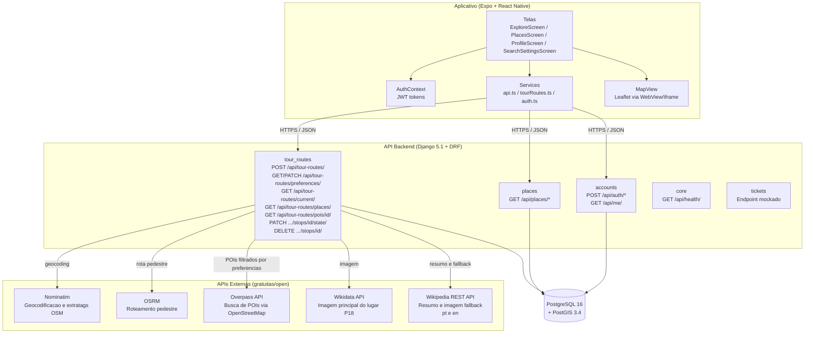
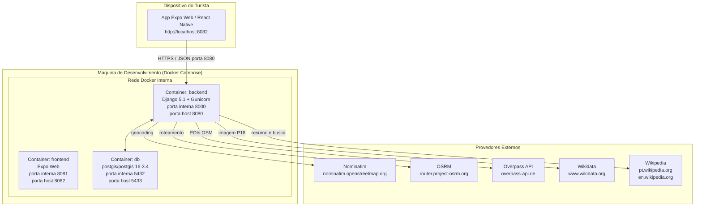
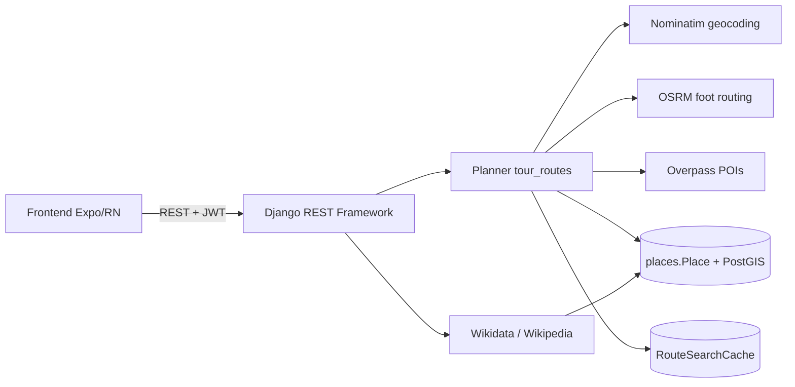
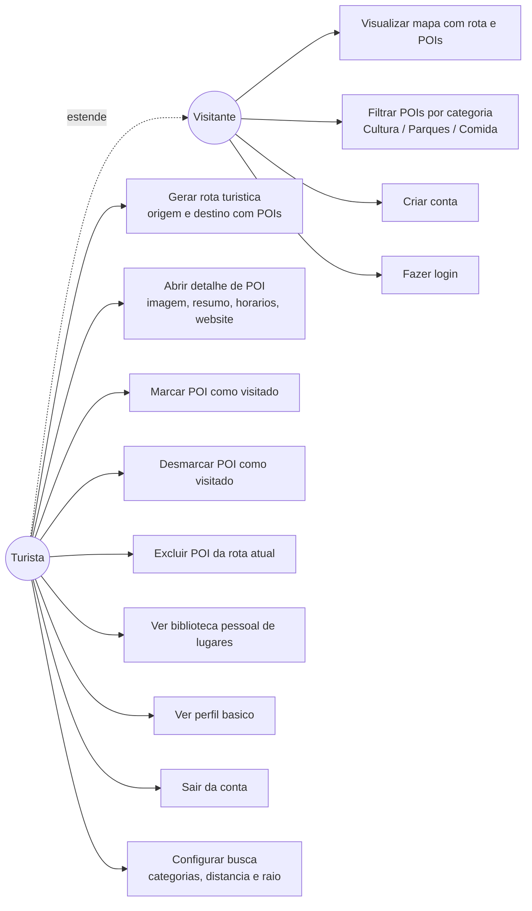
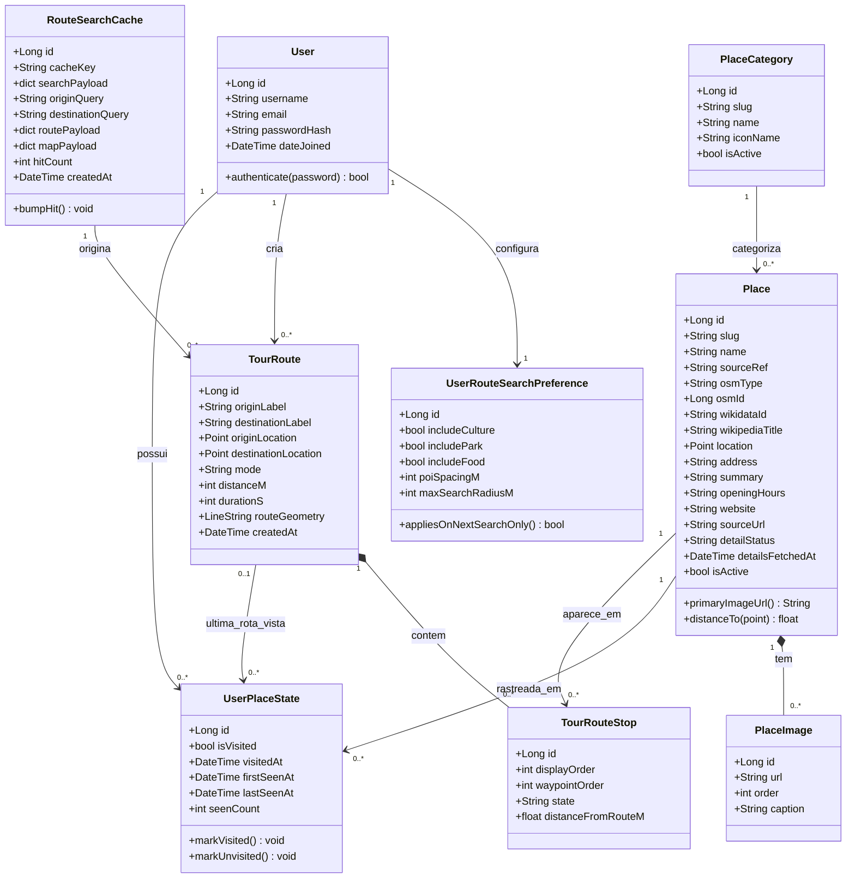
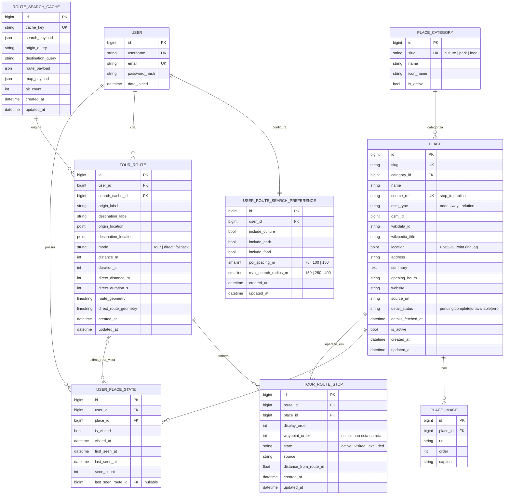
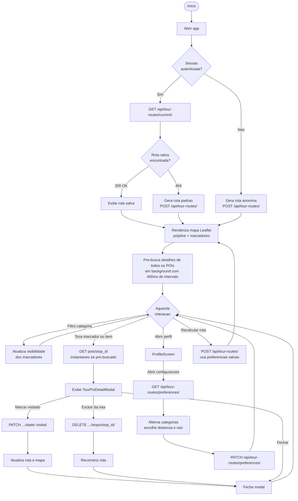
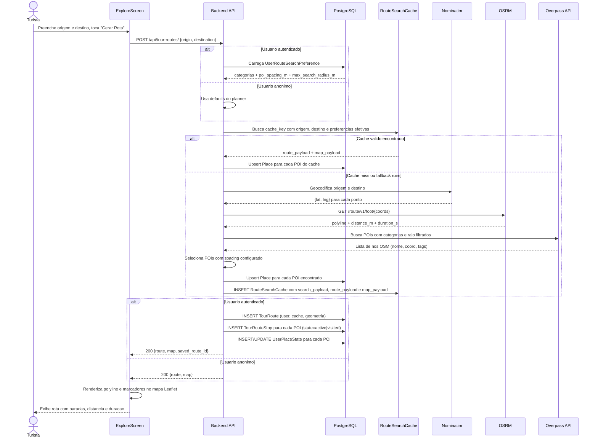
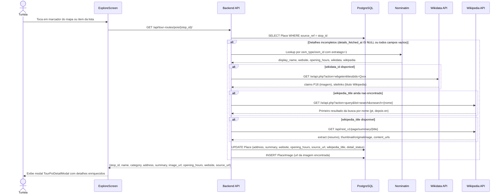
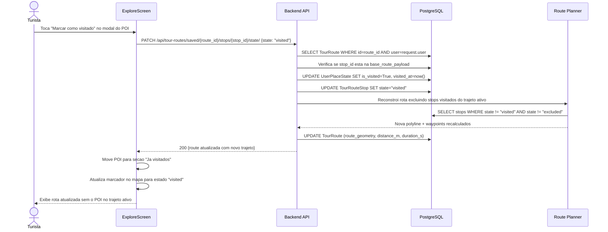

<div align="center">


# Explora+

**Planejador de rotas turísticas pedestres com descoberta automática de POIs no OpenStreetMap**

Projeto acadêmico da Universidade Católica de Santos (UniSantos) — disciplina de Projeto de Conclusão (PCE).
Dado um par origem/destino, o Explora+ calcula a rota a pé via **OSRM (modo `foot`)**, descobre Pontos de Interesse (POIs) próximos via **Overpass API**, enriquece cada POI progressivamente com dados do **Nominatim, Wikidata e Wikipedia** e persiste tudo num catálogo canônico (`places.Place`) com geometria PostGIS. Cada usuário autenticado tem uma biblioteca pessoal (`UserPlaceState`) que rastreia o que já viu, visitou ou removeu de uma rota.

</div>

---

## Sumário

- [Repositórios](#repositórios)
- [Visão de produto](#visão-de-produto)
- [Arquitetura](#arquitetura)
- [Stack](#stack)
- [Como subir o ambiente completo](#como-subir-o-ambiente-completo)
- [Diagramas](#diagramas)
- [Colaboradores](#colaboradores)
- [Instituição](#instituição)

---

## Repositórios

O Explora+ é composto por **três repositórios** versionados sob a organização [`EXPLORA-PLUS`](https://github.com/EXPLORA-PLUS) no GitHub. A recomendação é cloná-los lado a lado em uma mesma pasta de workspace:

```text
explora_plus/
├── backend/    # API Django + PostGIS + planner de rotas (docker-compose mora aqui)
├── frontend/   # App Expo / React Native (web + mobile)
└── docs/       # SETUP, modelagem, diagramas UML, paper LaTeX
```

| Repositório | Papel | Stack principal | Link |
|---|---|---|---|
| **explora-plus-backend** | API REST, planner, autenticação JWT, persistência canônica de lugares e rotas | Django 5.1 · DRF · SimpleJWT · PostgreSQL + PostGIS · Python 3.12 | <https://github.com/EXPLORA-PLUS/explora-plus-backend> |
| **explora-plus-frontend** | App cliente (web e mobile), mapa Leaflet em WebView/iframe, biblioteca pessoal | Expo 52 · React Native 0.76 · TypeScript · React Navigation 7 | <https://github.com/EXPLORA-PLUS/explora-plus-frontend> |
| **explora-plus-docs** | Documentação técnica, modelagem, diagramas UML/Mermaid, pacote final do Modelio e papers acadêmicos | Markdown · Mermaid · Modelio · LaTeX | <https://github.com/EXPLORA-PLUS/explora-plus-docs> |

> Para clonar tudo de uma vez:
> ```bash
> mkdir explora_plus && cd explora_plus
> git clone https://github.com/EXPLORA-PLUS/explora-plus-backend.git  backend
> git clone https://github.com/EXPLORA-PLUS/explora-plus-frontend.git frontend
> git clone https://github.com/EXPLORA-PLUS/explora-plus-docs.git     docs
> ```

---

## Visão de produto

<div align="center">

</div>

O Explora+ é uma **plataforma de propósito geral** para descoberta e navegação turística pedestre. Por ser construído inteiramente sobre dados abertos globais (OpenStreetMap, Wikidata, Wikipedia), o app não depende de parcerias comerciais locais e pode ser implantado em qualquer município com acervo registrado no OSM.

A entrega atual corresponde à **validação da arquitetura como MVP**: demonstra que o núcleo técnico (roteamento, enriquecimento progressivo de POIs, personalização por usuário) é sólido e escalável. As integrações com plataformas de eventos e mobilidade (Sympla, Uber etc.) e a definição da estratégia de distribuição e monetização constituem a próxima fase.

### Atores

A modelagem distingue dois atores ([UC1–UC12](https://github.com/EXPLORA-PLUS/explora-plus-docs/blob/main/MODELAGEM.md#casos-de-uso)):

- **Visitante (anônimo)** — pode visualizar o mapa com rota e POIs, filtrar por categoria, criar conta e fazer login.
- **Turista (autenticado, *estende* Visitante)** — gera rotas turísticas, abre detalhe de POI, marca/desmarca como visitado, exclui POIs da rota atual, vê biblioteca pessoal de lugares e perfil.

### Fluxo do app

1. **Bootstrap da sessão** — `AuthContext` tenta `POST /api/auth/refresh/` com o refresh token em storage; se falhar, cai em estado anônimo.
2. **Tela Explorar** — chama `GET /api/tour-routes/current/`. Se 404 (sem rota salva), dispara `POST /api/tour-routes/` com origem/destino padrão (Praça Oswaldo Cruz → Edifício Gibraltar, Av. Paulista).
3. **Planner do backend** — geocodifica via **Nominatim**, calcula rota pedestre via **OSRM**, busca POIs na bbox via **Overpass** e faz upsert em `places.Place`. Resultado entra em `RouteSearchCache` por chave canônica (origem+destino), evitando recálculos.
4. **Renderização** — `MapView` (Leaflet em `WebView` mobile / `iframe` web) desenha polyline + marcadores. POIs filtráveis por **Todos / Cultura / Parques / Comida**.
5. **Pré-busca em background** — após carregar a rota, o frontend pré-busca o detalhe de todos os POIs em background (400 ms entre chamadas), pra que abrir o modal seja instantâneo.
6. **Detalhe de POI** — `GET /api/tour-routes/pois/<stop_id>/` enriquece progressivamente: Nominatim (endereço, horários, `wikidata_id`) → Wikidata (imagem P18) → fallback de busca Wikipedia em `pt` → `en` se necessário.
7. **Personalização da rota** — cada `TourRouteStop` tem estado `active → visited → excluded` ([state machine](https://github.com/EXPLORA-PLUS/explora-plus-docs/blob/main/MODELAGEM.md#estados--stop-na-rota)). Ao marcar como visitado, o backend recalcula a rota sem o POI no trajeto ativo.
8. **Biblioteca pessoal** — aba **Lugares** lista `UserPlaceState` do usuário, com filtros: Todos / Visitados / Não visitados / Rota atual / Excluídos.

---

## Arquitetura

### Componentes



### Implantação



### Fluxo de alto nível



---

## Stack

| Camada | Tecnologias |
|---|---|
| **Backend** | Python 3.12, Django 5.1, DRF 3.15, SimpleJWT 5.3, GeoDjango (`django.contrib.gis`), psycopg2 |
| **Banco** | PostgreSQL 16 + PostGIS 3.4 |
| **Frontend** | Expo SDK 52, React Native 0.76, React 18, TypeScript, React Navigation 7, React Native WebView, Reanimated |
| **Mapa** | Leaflet embarcado via HTML em `WebView` (mobile) / `iframe` (web) |
| **Infra local** | Docker + Docker Compose, `entrypoint.sh` no backend |
| **Fontes externas** | Nominatim (geocoding + extratags), OSRM (rota pedestre), Overpass (POIs), Wikidata (P18), Wikipedia (descrição/imagem) |
| **Docs / modelagem** | Mermaid, Modelio (UML), LaTeX (paper) |

---

## Como subir o ambiente completo

> Guia detalhado em [`docs/SETUP.md`](https://github.com/EXPLORA-PLUS/explora-plus-docs/blob/main/SETUP.md). Resumo abaixo.

### 1. Clonar os 3 repositórios lado a lado

Veja [Repositórios](#repositórios).

### 2. Configurar variáveis de ambiente

```bash
cp backend/.env.example  backend/.env
cp frontend/.env.example frontend/.env
```

Ajuste `DJANGO_SECRET_KEY` no `backend/.env`. O `frontend/.env` deve apontar para o backend (por padrão `EXPO_PUBLIC_API_URL=http://localhost:8080`).

### 3. Subir backend + banco

O `docker-compose.yml` mora no `backend/` e referencia o `frontend/` como caminho irmão.

```bash
cd backend
docker compose up --build -d
docker compose exec backend python manage.py migrate
docker compose exec backend python manage.py seed_demo --reset   # opcional
```

### 4. Verificar saúde da API

- Backend: <http://localhost:8080/api/health/>
- Admin Django: <http://localhost:8080/admin/>

### 5. Subir frontend

```bash
cd ../frontend
npm install
npm run web          # abre o Expo Web (geralmente em http://localhost:8081)
```

### Portas padrão

| Serviço | Host | Container |
|---|---|---|
| Backend (Django/Gunicorn) | `8080` | `8000` |
| PostgreSQL + PostGIS | `5433` | `5432` |
| Frontend (Expo Web via Docker) | `8082` | `8081` |

---

## Diagramas

Todos os diagramas estão versionados em [`paper-pce/figuras/`](https://github.com/EXPLORA-PLUS/explora-plus-docs/tree/main/paper-pce/figuras) e [`paper-pcg/figuras/`](https://github.com/EXPLORA-PLUS/explora-plus-docs/tree/main/paper-pcg/figuras) (exportações PNG para paper), em [`diagramas/mermaid/`](https://github.com/EXPLORA-PLUS/explora-plus-docs/tree/main/diagramas/mermaid) (fontes Mermaid editáveis) e no pacote final do Modelio [`explora-plus-diagramas-uml-modelio-final.zip`](https://github.com/EXPLORA-PLUS/explora-plus-docs/blob/main/explora-plus-diagramas-uml-modelio-final.zip) dentro do repo `explora-plus-docs`. Neste perfil, a preferência é mostrar os Mermaid diretamente para manter a documentação viva e fácil de atualizar.

### Casos de uso



### Classes



### Modelo Entidade-Relacionamento



### Atividade — fluxo Explorar



### Sequência — gerar rota



### Sequência — detalhe de POI



### Sequência — marcar como visitado



---

## Colaboradores

Equipe extraída do histórico Git dos três repositórios (`git log --all`).

| Nome | Papel | E-mail | Repositórios |
|---|---|---|---|
| **Lucas Cerqueira Galvão** | Desenvolvimento (backend + frontend + docs) | <lucasgalvao134@gmail.com> | backend · frontend · docs |
| **Lucas Carmona Neto** | Desenvolvimento (backend + frontend + docs) | <lucascarmonaneto510@gmail.com> | backend · frontend · docs |
| **João Gabriel Catalão** | Desenvolvimento (backend) | <joaogabriel3556@gmail.com> | backend |
| **Felipe Barbosa dos Santos** | Documentação e modelagem | <felipebsantos@unisantos.br> | docs |
| **Felipe Monteiro** | Documentação e modelagem | <felipemonteiro@unisantos.br> | docs |

---

## Status

| Fase | Estado |
|---|---|
| Arquitetura central (roteamento + enriquecimento de POIs + personalização) | ✅ Validada |
| Aprovação do PO e demonstração do protótipo | ✅ Concluída |
| Modelo de monetização e estratégia de distribuição | 🔜 Próxima fase |
| Integrações com plataformas de eventos e mobilidade (Sympla, Uber etc.) | 🔜 Pós-monetização |

---

## Instituição

Projeto desenvolvido na **Universidade Católica de Santos (UniSantos)** como Projeto de Conclusão (PCE).  
Organização GitHub: <https://github.com/EXPLORA-PLUS>  
Paper completo em [`paper/main.pdf`](https://github.com/EXPLORA-PLUS/explora-plus-docs/blob/main/paper/main.pdf) · proposta original em [`paper/proposta-original.pdf`](https://github.com/EXPLORA-PLUS/explora-plus-docs/blob/main/paper/proposta-original.pdf).
