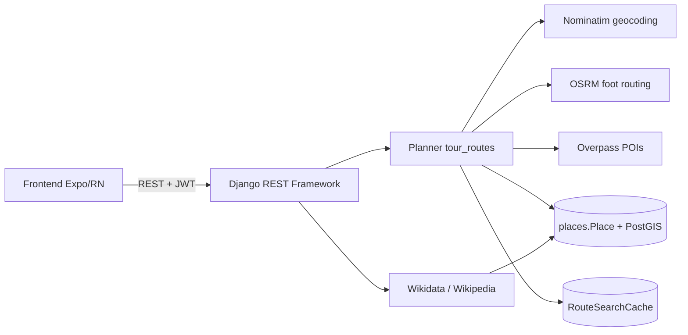

<div align="center">


# Explora+

**Planejador de rotas turísticas a pé com descoberta automática de POIs**

Projeto acadêmico da Universidade Católica de Santos (UniSantos) — disciplina de Projeto de Conclusão (PCE).
O sistema gera rotas pedestres entre dois pontos, sugere POIs (cultura, parques, comida) ao longo do caminho, enriquece cada POI com dados do OSM/Wikidata/Wikipedia e mantém uma biblioteca pessoal de lugares visitados pelo usuário.

</div>

---

## Sumário

- [Repositórios](#repositórios)
- [Visão de produto](#visão-de-produto)
- [Arquitetura](#arquitetura)
- [Stack](#stack)
- [Como subir o ambiente completo](#como-subir-o-ambiente-completo)
- [Diagramas](#diagramas)
- [Colaboradores](#colaboradores)
- [Instituição](#instituição)

---

## Repositórios

O Explora+ é composto por **três repositórios** versionados sob a organização [`EXPLORA-PLUS`](https://github.com/EXPLORA-PLUS) no GitHub. A recomendação é cloná-los lado a lado em uma mesma pasta de workspace:

```text
explora_plus/
├── backend/    # API Django + PostGIS + planner de rotas (docker-compose mora aqui)
├── frontend/   # App Expo / React Native (web + mobile)
└── docs/       # SETUP, modelagem, diagramas UML, paper LaTeX
```

| Repositório | Papel | Stack principal | Link |
|---|---|---|---|
| **explora-plus-backend** | API REST, planner, autenticação JWT, persistência canônica de lugares e rotas | Django 5.1 · DRF · SimpleJWT · PostgreSQL + PostGIS · Python 3.12 | <https://github.com/EXPLORA-PLUS/explora-plus-backend> |
| **explora-plus-frontend** | App cliente (web e mobile), mapa Leaflet em WebView/iframe, biblioteca pessoal | Expo 52 · React Native 0.76 · TypeScript · React Navigation 7 | <https://github.com/EXPLORA-PLUS/explora-plus-frontend> |
| **explora-plus-docs** | Documentação técnica, modelagem, diagramas UML/Mermaid, paper acadêmico | Markdown · Mermaid · Modelio · LaTeX | <https://github.com/EXPLORA-PLUS/explora-plus-docs> |

> Para clonar tudo de uma vez:
> ```bash
> mkdir explora_plus && cd explora_plus
> git clone https://github.com/EXPLORA-PLUS/explora-plus-backend.git  backend
> git clone https://github.com/EXPLORA-PLUS/explora-plus-frontend.git frontend
> git clone https://github.com/EXPLORA-PLUS/explora-plus-docs.git     docs
> ```

---

## Visão de produto

<div align="center">

</div>

O fluxo principal do MVP é:

1. O usuário cria conta ou faz login.
2. A tela **Explorar** tenta reabrir a rota atual salva; se não houver, gera uma rota de exemplo na Av. Paulista.
3. O backend geocodifica origem/destino, calcula a rota pedestre (OSRM), descobre POIs próximos (Overpass) e materializa cada POI em `places.Place`.
4. O mapa mostra origem, destino, linha da rota e POIs filtráveis por **Cultura / Parques / Comida**.
5. O usuário pode abrir o detalhe de um POI (enriquecido em background com Nominatim + Wikidata + Wikipedia), marcar como visitado ou excluir da rota atual.
6. A aba **Lugares** vira a biblioteca pessoal de POIs que já apareceram em rotas do usuário.

---

## Arquitetura

### Componentes

<div align="center">

</div>

### Implantação

<div align="center">

</div>

### Fluxo de alto nível



---

## Stack

| Camada | Tecnologias |
|---|---|
| **Backend** | Python 3.12, Django 5.1, DRF 3.15, SimpleJWT 5.3, GeoDjango (`django.contrib.gis`), psycopg2 |
| **Banco** | PostgreSQL 16 + PostGIS 3.4 |
| **Frontend** | Expo SDK 52, React Native 0.76, React 18, TypeScript, React Navigation 7, React Native WebView, Reanimated |
| **Mapa** | Leaflet embarcado via HTML em `WebView` (mobile) / `iframe` (web) |
| **Infra local** | Docker + Docker Compose, `entrypoint.sh` no backend |
| **Fontes externas** | Nominatim (geocoding + extratags), OSRM (rota pedestre), Overpass (POIs), Wikidata (P18), Wikipedia (descrição/imagem) |
| **Docs / modelagem** | Mermaid, Modelio (UML), LaTeX (paper) |

---

## Como subir o ambiente completo

> Guia detalhado em [`docs/SETUP.md`](https://github.com/EXPLORA-PLUS/explora-plus-docs/blob/main/SETUP.md). Resumo abaixo.

### 1. Clonar os 3 repositórios lado a lado

Veja [Repositórios](#repositórios).

### 2. Configurar variáveis de ambiente

```bash
cp backend/.env.example  backend/.env
cp frontend/.env.example frontend/.env
```

Ajuste `DJANGO_SECRET_KEY` no `backend/.env`. O `frontend/.env` deve apontar para o backend (por padrão `EXPO_PUBLIC_API_URL=http://localhost:8080`).

### 3. Subir backend + banco

O `docker-compose.yml` mora no `backend/` e referencia o `frontend/` como caminho irmão.

```bash
cd backend
docker compose up --build -d
docker compose exec backend python manage.py migrate
docker compose exec backend python manage.py seed_demo --reset   # opcional
```

### 4. Verificar saúde da API

- Backend: <http://localhost:8080/api/health/>
- Admin Django: <http://localhost:8080/admin/>

### 5. Subir frontend

```bash
cd ../frontend
npm install
npm run web          # abre o Expo Web (geralmente em http://localhost:8081)
```

### Portas padrão

| Serviço | Host | Container |
|---|---|---|
| Backend (Django/Gunicorn) | `8080` | `8000` |
| PostgreSQL + PostGIS | `5433` | `5432` |
| Frontend (Expo Web via Docker) | `8082` | `8081` |

---

## Diagramas

Todos os diagramas estão versionados em [`paper/figuras/`](https://github.com/EXPLORA-PLUS/explora-plus-docs/tree/main/paper/figuras) (PNG) e em [`diagramas/mermaid/`](https://github.com/EXPLORA-PLUS/explora-plus-docs/tree/main/diagramas/mermaid) (fontes Mermaid editáveis) no repo `explora-plus-docs`.

### Casos de uso

<div align="center">

</div>

### Classes

<div align="center">

</div>

### Modelo Entidade-Relacionamento

<div align="center">

</div>

### Atividade — fluxo Explorar

<div align="center">

</div>

### Sequência — gerar rota

<div align="center">

</div>

### Sequência — detalhe de POI

<div align="center">

</div>

### Sequência — marcar como visitado

<div align="center">

</div>

---

## Colaboradores

Equipe extraída do histórico Git dos três repositórios (`git log --all`).

| Nome | Papel | E-mail | Repositórios |
|---|---|---|---|
| **Lucas Cerqueira Galvão** | Desenvolvimento (backend + frontend + docs) | <lucasgalvao134@gmail.com> | backend · frontend · docs |
| **Lucas Carmona Neto** | Desenvolvimento (backend + frontend + docs) | <lucascarmonaneto510@gmail.com> | backend · frontend · docs |
| **João Gabriel Catalão** | Desenvolvimento (backend) | <joaogabriel3556@gmail.com> | backend |
| **Felipe Barbosa dos Santos** | Documentação e modelagem | — | docs |
| **Felipe Monteiro** | Orientação acadêmica | <felipemonteiro@unisantos.br> | docs |

---

## Instituição

Projeto desenvolvido na **Universidade Católica de Santos (UniSantos)** como Projeto de Conclusão (PCE).
Paper completo em [`paper/main.pdf`](https://github.com/EXPLORA-PLUS/explora-plus-docs/blob/main/paper/main.pdf) · proposta original em [`paper/proposta-original.pdf`](https://github.com/EXPLORA-PLUS/explora-plus-docs/blob/main/paper/proposta-original.pdf).
